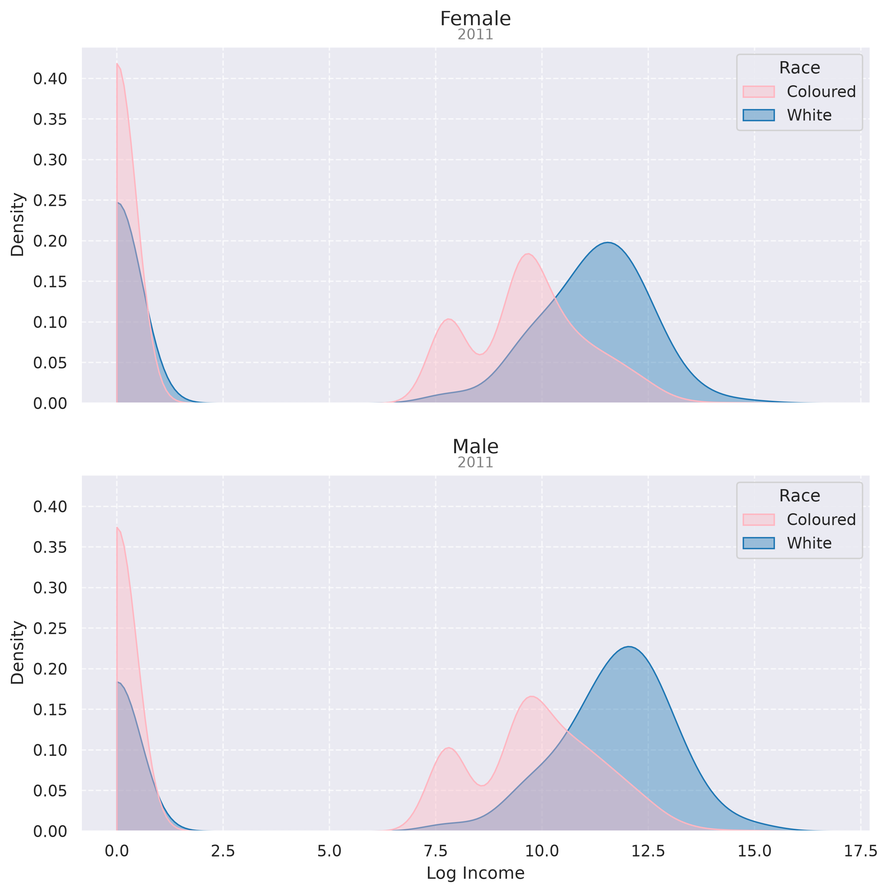

## Introduction

The history of South Africa stands as a fascinating case study for the field of `Causal Inference for Computational Social Science`. The Apartheid era was black-and-white legalized discrimination, *literally*. The implementation of the National Party's ideological framework hinged on the Population Registration Act of 1950, which required every citizen to be classified and registered under racial categories. The government was then able to dictate an individual's rights from "cradle to grave" [@lawal_april_2024]. Subsequent legislation such as the Group Areas Act forced non-white populations into the country’s most economically unproductive areas, while "pass laws" criminalized the unregulated movement of Coloured citizens within urban spaces. Systemic oppression extended to all individual pursuits: schools were segregated and interpersonal relationships across racial lines were legally barred through measures like the Prohibition of Mixed Marriages Act. 

In their foundational study examining the direct effects of these Apartheid-era classifications, researchers utilized historical data to demonstrate that being classified as White yielded a massive 4.5x increase in income for men and an average of 5 additional years of formal education. These advantages explained approximately 94% of the total observed mean income disparity between White and Coloured men [@pellicer_understanding_2023]. 

The contact hypothesis [@bornman_patterns_2011] suggests a lack of contact between groups leads to negative attitudes. To foster improved intergroup attitudes, researchers argue that specific conditions must be met: equal status, shared goals, and the development of personal relationships supported and condoned by authorities. Whether post-Apartheid legislative reforms have effectively cultivated these conditions remains an open question. While all South Africans are now constitutionally recognized as equals, the state has implemented aggressive interventions, such as equity quotas for businesses with more than 50 employees, to actively redress historical disenfranchisement [@sakeliga_quotas_2025]. These policies remain highly contentious; critics characterize them as unconstitutional forms of social engineering. These competing sociological and political realities underscore a fundamental economic inquiry: *in the wake of Apartheid, to what extent have labor market disparities between racial categories actually changed?*

This study aims to tackle that question by executing a pooled cross-sectional replication of the original research framework. Utilizing a 10% sample of microdata from the 2001 and 2011 South African Censuses, I isolate a cohort born after the formal end of Apartheid in 1994. By stratifying our sample by gender and executing Ordinary Least Squares (OLS) regression models that control for age, employment status, and discrete education levels, I directly estimate income. Ultimately, this paper evaluates whether the racial wage gap between "White" and "Coloured" cohorts has shrunk, stagnated, or increased, providing fresh insights into South African labor outcomes.

## Data

South African Census Data

## Exploratory Analysis

Income Graphs by Gender

{#fig-2011-income}

Tables

## Models

Pushing Torwards the Asymptote of Causality. . . 

### Ordinary Least Squares

Most Basic Model (2011 only)

Pooling (2001 & 2011)

## Evaluation

Evaluation Section

## Conclusion

Conclude

## Acknowledgments {.unnumbered}

Professor Jacobs

## References {.unnumbered}

::: {#refs}
:::
