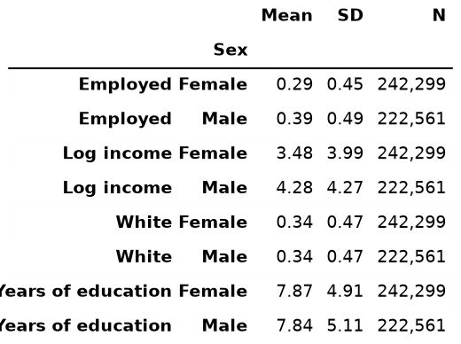
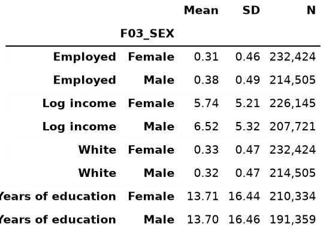
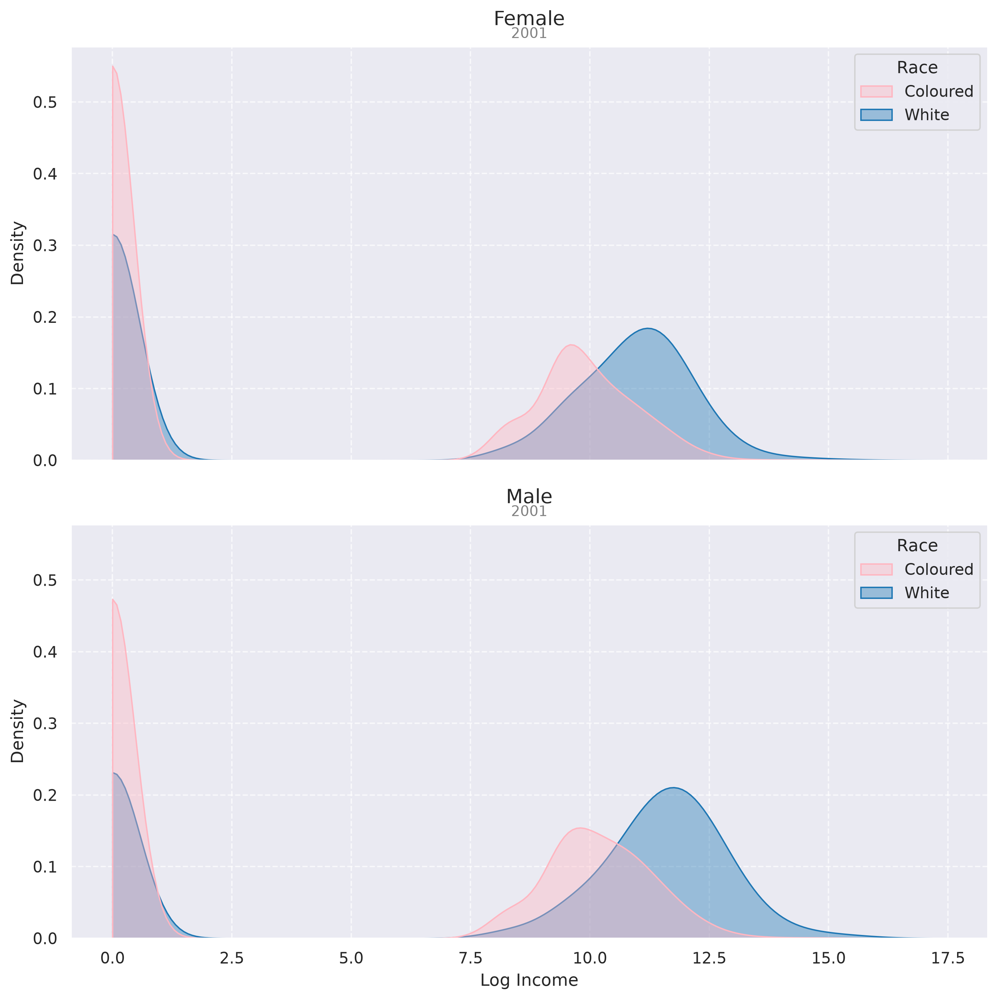
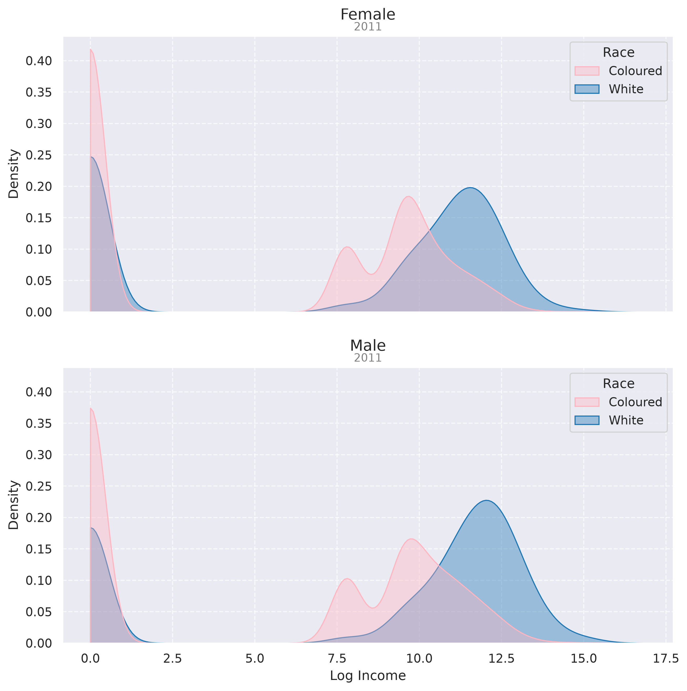
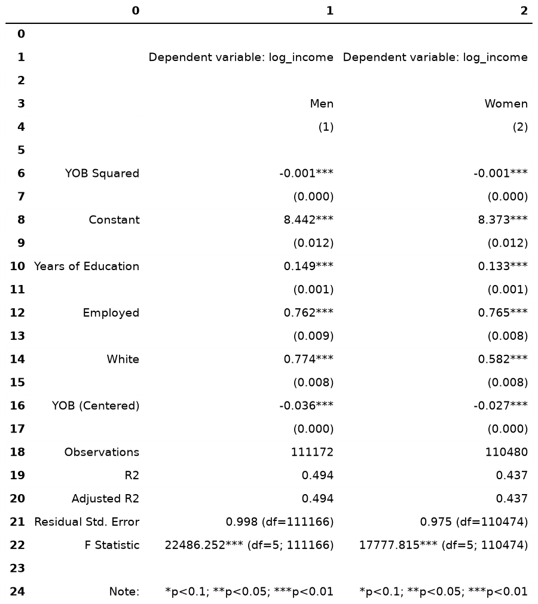
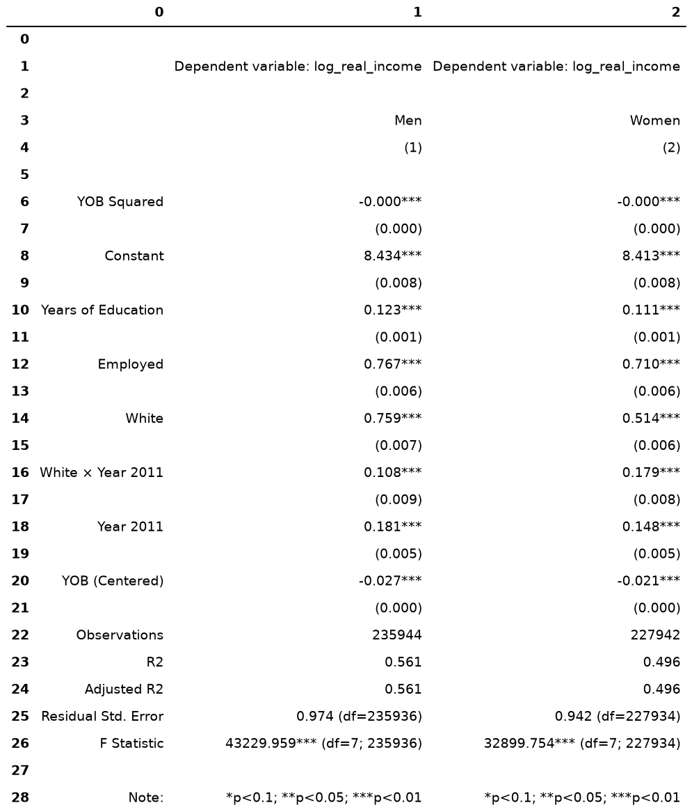
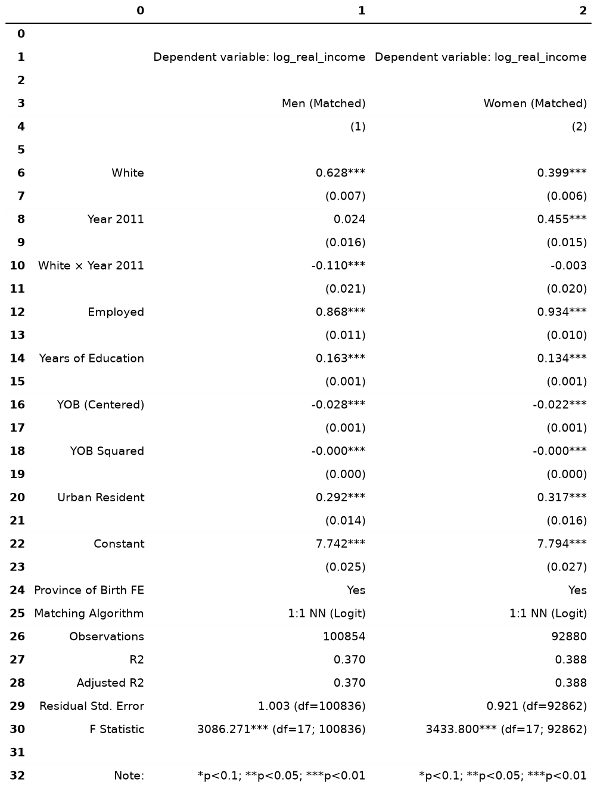
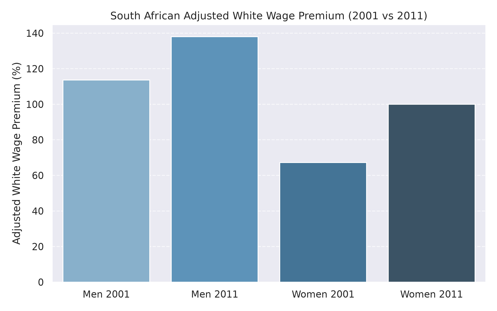
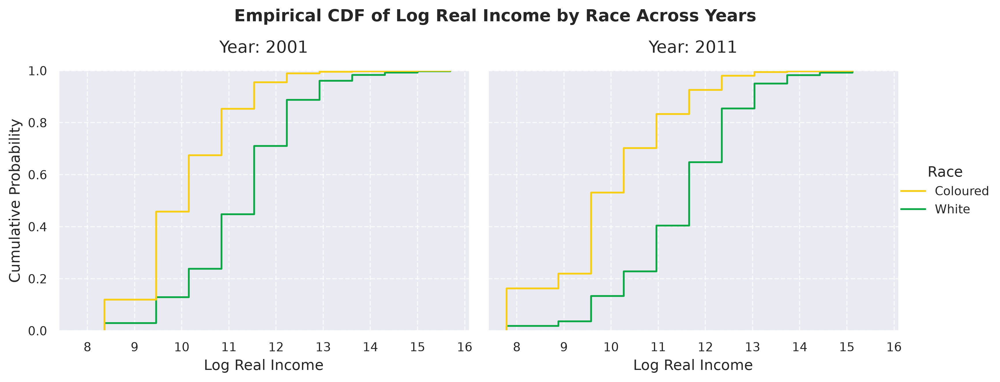

## Introduction

The history of South Africa stands as a fascinating case study for the field of `Causal Inference for Computational Social Science`. The Apartheid era was black-and-white legalized discrimination (literally). The implementation of the National Party's ideological framework hinged on the Population Registration Act of 1950, which required every citizen to be classified and registered under racial categories. The government was then able to dictate an individual's rights from "cradle to grave" [@lawal_april_2024]. Subsequent legislation such as the Group Areas Act forced non-white populations into the country’s most economically unproductive areas, while "pass laws" criminalized the unregulated movement of Coloured citizens within urban spaces. Systemic oppression extended to all individual pursuits: schools were segregated and interpersonal relationships across racial lines were legally barred through measures like the Prohibition of Mixed Marriages Act. 

In their foundational study examining the direct effects of these Apartheid-era classifications, researchers utilized historical data to demonstrate that being classified as White yielded a massive 4.5x increase in income for men and an average of 5 additional years of formal education. These advantages explained approximately 94% of the total observed mean income disparity between White and Coloured men [@pellicer_understanding_2023]. 

The contact hypothesis [@bornman_patterns_2011] suggests a lack of contact between groups leads to negative attitudes. To foster improved intergroup attitudes, researchers argue that specific conditions must be met: equal status, shared goals, and the development of personal relationships supported and condoned by authorities. Whether post-Apartheid legislative reforms have effectively cultivated these conditions remains an open question. While all South Africans are now constitutionally recognized as equals, the state has implemented aggressive interventions, such as equity quotas for businesses with more than 50 employees, to actively correct historical disenfranchisement [@sakeliga_quotas_2025]. These policies remain highly contentious; critics characterize them as unconstitutional forms of social engineering. The competing sociological and political realities underscore a fundamental economic inquiry: *in the wake of Apartheid, to what extent have labor market disparities between racial categories actually changed?*

This study aims to tackle that question by executing a pooled cross-sectional replication of the original research framework. Utilizing a 10% sample of microdata from the 2001 and 2011 South African Censuses, I analyze a cohort following the formal end of Apartheid in 1994. By stratifying the sample by gender and executing Ordinary Least Squares (OLS) regression models that control for age, employment status, and education level, I directly estimate income. Ultimately, this paper evaluates whether the racial wage gap between "White" and "Coloured" cohorts has shrunk, stagnated, or increased, providing fresh insights into South African labor outcomes.

## Data

This study uses data from the 2001 [@statssa_census_2001] and 2011 [@statssa_census_2011] South African Population Censuses^[Censuses are principal means of collecting basic population and housing statistics required for social and economic development, policy interventions, their implementation and evaluation; the Post-Apartheid South African government has conducted three Censuses, in 1996, 2001 and 2011] conducted by Statistics South Africa (Stats SA). Both the 2001 and 2011 datasets used in this analysis are 10% public-use samples of the full census population.

Observations with unspecified income or unknown employment status were excluded from the analysis. Specifically, 339,531 observations (~7.8% of the sample) with unspecified income and 3,222 observations (~0.1% of the sample) with unknown employment status were removed prior to analysis.

The variables were selected to match those used in the original study, which analyzed differences using sex, race, years of education, employment status, and log income. For the 2011 Census, the following variables were extracted from the person-level dataset:

* **Sex** (`F03_SEX`), coded as 1 = Male and 2 = Female
* **Year** (`P01_YEAR`)
* **Population group** (`P05_POP_GROUP`), coded as Black African, Coloured, Indian/Asian, White, and Other
* **Income** (`P16_INCOME`), reported as categorical income brackets ranging from no income to R 2,457,601, with a separate category for unspecified income
* **Educational attainment** (`P20_EDULEVEL`), ranging from Grade 0 through higher degree, with additional categories for no schooling and other qualifications
* **Employment status** (`P23A_EMPLOYMENTSTATUS`), coded as employed, unemployed, or unknown

For the 2001 Census, comparable variables were identified to maximize consistency across survey years. These included sex (`p03_sex`), race (`p06_race`), education (`p17_educ`), employment status (`der10_em`), and income (`p22_incm`). Additional variables related to date of birth (`p02_day`, `p02_mth`, and `p02_yr`) and age (`p02_age`) were retained.

The variable definitions were obtained from the official DataFirst data dictionary for the South African Census person dataset.

## Exploratory Analysis

Figures 1 and 2 present descriptive statistics for the 2001 and 2011 Census samples by sex. Across both census years, men exhibited higher employment rates than women. In 2001, 39% of men were employed compared to 29% of women, while in 2011 employment increased slightly for both groups to 38% and 31%, respectively. Average log income also increased substantially between 2001 and 2011 for both sexes, with men consistently reporting higher average log incomes than women. Mean years of education increased considerably over the decade, rising from approximately 7.6 years in 2001 to 13.7 years in 2011 for both men and women. The proportion of White respondents remained relatively stable across years and sexes, accounting for roughly one-third of each analytic sample.

{#fig-2001-table}

{#fig-2001-table}

The distribution of log income by race and sex is shown in Figures 3 and 4 for the 2001 and 2011 Census samples, respectively. Both years exhibit a pronounced spike at zero log income, reflecting individuals who reported no income. Among respondents with positive income, the distributions differ noticeably by race. White respondents display income distributions centered at higher log-income values than Coloured respondents for both men and women, with the White distributions shifted to the right and exhibiting a broader upper tail

{#fig-2001-income}

{#fig-2011-income}

Comparing the two census years, the overall shape of the income distributions remains similar, although the distributions for positive income shift toward higher log-income values in 2011. The separation between the White and Coloured income distributions is evident in both years for males and females, suggesting persistent differences in reported earnings across racial groups. Additionally, the income distributions for men are slightly shifted toward higher values than those for women within each racial group, consistent with the descriptive statistics reported in Figures 1 and 2.

## Models

The original study that this project builds on relied on fuzzy Regression Discontinuity (RD)^[According to FRDD, the outcome variable undergoes a sharp discontinuity at the threshold, but the assignment to a treatment or control group is not perfectly determined by this discontinuity; using a fuzzy score that reflects the degree of uncertainty associated with group assignment, it is possible to quantify the degree of noise in group assignment] designs to exploit localized exogenous^[An exogenous variable is an explanatory variable that is not correlated with the error term] variation. While fuzzy RD designs offer strong local internal validity, the primary drawback is in external validity: treatment effect estimates are localized strictly around the discontinuity threshold, limiting generalizability across broader populations.

Additionally, standard Ordinary Least Squares (OLS) specifications capture strong predictive associations but fail to account for omitted variable bias^[For an omitted variable to bias the results, it must correlate with the dependent variable and at least one independent variable, making it a confounding variable]. Furthermore, simple cross-sectional models cannot evaluate whether structural wage premiums persist across macro-level economic shifts or if they are artifacts of single-year selection mechanisms.

To address these shortcomings, this analysis proceeds in stages. I first establish baseline cross-sectional OLS estimates stratified by gender using the 2011 sample. I then progress toward a more robust pooled cross-sectional design combining the 2001 and 2011 datasets. By pooling repeated cross-sections, I evaluate how racial wage premiums evolved over a decade of institutional change, while explicitly controlling for non-linear lifecycle cohort trajectories that typically confound single-year cross-sectional estimates.

### Ordinary Least Squares on 2011 Alone

To establish a baseline relationship, I estimate an Ordinary Least Squares (OLS) regression separately for men and women using the 2011 sample. The dependent variable is natural log income ($\text{Log Income}_i$). To account for non-linear lifecycle earnings dynamics while mitigating multicollinearity between age terms, year of birth ($\text{YOB}_i$) is centered around the sample mean ($\overline{\text{YOB}}$).The baseline specification is defined as:

$$
\text{Log Income}_i = \beta_0 + \beta_1 \text{White}_i + \beta_2 \text{EduYears}_i + \beta_3 \text{Age}_i + \beta_4 \text{Age}_i^2 + \beta_5 \text{Employed}_i + \varepsilon_i
$$

Because log income distributions frequently exhibit heteroskedastic error^[Heteroskedasticity occurs when the variance of the error terms is not constant across all levels of the independent variable(s)] structures across demographic strata, all specifications employ heteroskedasticity-consistent standard errors ($\text{HC1}$) to ensure reliable hypothesis testing.

Figure 5 summarizes the 2011 OLS estimates stratified by gender. Across both specifications, all covariates are statistically significant at $p < 0.05$. The baseline controls account for $43.7\%$ of the variance in log income for women ($R^2 = 0.437, N = 110,480$) and $49.4\%$ of the variance for men ($R^2 = 0.494, N = 111,172$).

{#fig-2011-OLS}

The estimated returns to education are higher for men ($14.9\%$ log income gain per additional year of schooling) than for women ($13.3\%$). Similarly, the white wage premium is noticeably larger for men ($\hat{\beta}_1 = 0.774$) than for women ($\hat{\beta}_1 = 0.582$).

The income advantage associated with active employment is almost identical across genders, approximately a $76\%$ log-income gain relative to non-employed individuals ($\hat{\beta}_2 \approx 0.76$).

The negative linear coefficient on centered YOB alongside the negative quadratic term reflects the concave lifecycle earnings profile, capturing declining earnings for younger cohorts relative to middle-aged workers in the 2011 cross-section.

### OLS on Pooled Data

To address potential identification threats inherent in a single cross-section, the OLS model was expanded by pooling data from the 2001 and 2011 census. An a priori threat to causal inference in single-year cross-sectional models is that individual income exhibits a pronounced non-linear lifecycle trajectory. In a single cross-section, birth cohort ($\text{YOB}$) and current age are perfectly collinear, making it difficult to disentangle true shifts from standard career trajectory.

By introducing a second observation point a decade prior ($t = 2001$), individuals of similar ages at different points in time are observed and specific birth cohorts across different career stages are tracked. This temporal variance better identifies and controls for non-linear lifecycle patterns while evaluating structural shifts in the racial wage gap over time.

$$
\text{Log Income}_{it} = \beta_0 + \beta_1 \text{White}_{it} + \beta_2 \text{Year2011}_t + \beta_3 (\text{White}_{it} \times \text{Year2011}_t) + {\gamma} \mathbf{X}_{it} + \varepsilon_{it}
$$

where $\text{Year2011}_t$ is an indicator equal to $1$ for observations from the 2011 wave and $0$ for 2001, and $\mathbf{X}_{it}$ vector includes controls for education, employment status, centered year of birth, and its quadratic term ($\text{YOB}^2$). The parameter $\beta_1$ measures the baseline racial log-income differential in 2001, $\beta_2$ captures general macro-level income growth between 2001 and 2011, and the interaction coefficient $\beta_3$ isolates how the white income premium evolved over the ten-year period.

To ensure comparability across survey years, income measures were *wrangled* prior to logarithmic transformation. The 2001 Census captured monthly income ranges, whereas the 2011 Census captured annual income ranges. Monthly 2001 values were converted to annual terms ($\times 12$) and adjusted for aggregate inflation using CPI metrics to reflect real constant 2011 values.

Table 2 presents the pooled regression results for men ($N = 412,949$) and women ($N = 451,808$). The pooled specifications explain the variance with an $R^2 = 0.558$ for men and $R^2 = 0.495$ for women.

{#fig-pooled-OLS}

In 2001, the baseline adjusted white wage premium ($\hat{\beta}_1$) was $113.6\%$ ($\hat{\beta}_1 = 0.759$) for men and $67.2\%$ ($\hat{\beta}_1 = 0.514$) for women. The statistically significant positive interaction terms ($\hat{\beta}_3 = 0.108, p < 0.01$ for men; $\hat{\beta}_3 = 0.179, p < 0.01$ for women) indicate that the racial wage gap expanded considerably between 2001 and 2011 across both genders, reaching $138.0\%$ for men and $99.9\%$ for women, even after controlling for education, employment status, and lifecycle controls.

In the pooled model, the quadratic cohort term ($\text{YOB Squared}$) is negative and highly significant ($\hat{\beta} = -0.000, p < 0.01$), confirming an inverted-U lifecycle earnings profile across birth cohorts once broader macro-level temporal shifts are held constant.

Active employment yields substantial log-income gains across both specifications ($\hat{\beta} = 0.767$ for men; $\hat{\beta} = 0.710$ for women, representing a $100\%–115\%$ wage premium over non-working or zero-income baselines). Furthermore, returns to formal education in the pooled model are consistently high across both genders, yielding an estimated $12.3\%$ increase in log earnings per year of schooling for men ($\hat{\beta} = 0.123$) and $11.1\%$ for women ($\hat{\beta} = 0.111$).

### Propensity Score Matching

Propensity Score Matching is a statistical technique used to reduce selection bias by matching individuals from different groups based on similar characteristics. It attempts to simulate the conditions of a randomized experiment.

A propensity score is the probability that an individual receives the treatment given a set of observed covariates.

$e(x) = P(T=1 | X)$

This study aims to estimate the probability of an individual being classified into a specific racial group based on their observable background traits.

- Treatment ($D_i$): Racial classification (e.g., $D_i = 1$ if White, $D_i = 0$ if Coloured or African)
- Covariates ($X_i$): Observable characteristics that shouldn't logically be downstream consequences of the treatment, or that represent pre-market baseline traits—primarily Birth Cohort / Age, Province/Geography, and Gender
- Propensity Score ($P(X_i)$): $P(D_i = 1 \mid X_i) = \text{Probability of being White given your age, location, and gender}$

{#fig-propensity-OLS}

## Evaluation

The empirical findings demonstrate a substantial and expanding adjusted white wage premium across both genders between 2001 and 2011. Applying the Halvorsen-Palmquist transformation to the pooled OLS coefficients shows that controlling for education, employment status, and quadratic lifecycle cohort dynamics, the adjusted racial wage gap for men grew from 113.6% in 2001 to 138.0% in 2011. For women, the adjusted premium widened even more dramatically, rising from 67.2% to 99.9% over the same period. These estimates highlight two key structural trends: a persistent gender asymmetry where men experience higher baseline racial gaps, and a widening post-apartheid income divergence within comparable human capital cohorts.

Complementing these regression estimates, the empirical cumulative distribution functions (ECDF) establish clear first-order stochastic dominance. Across both survey years, the real income distribution for white workers lies strictly to the right of non-white workers across virtually all quantiles, confirming that the observed racial premium reflects systemic labor market stratification rather than top-income tail distortion. Furthermore, the shared horizontal range across both racial groups confirms common support, validating the structural comparability of the pooled samples.

Methodologically, standardizing the 2001 monthly census reporting to annual 2011 constant Rands resolved artificial baseline scale inflation, yielding aligned mean log real incomes near 10.5 across both periods. Despite these data harmonization improvements, important identification limitations remain. Because the census lacks data on educational quality, occupational sector, and unobserved worker ability, the race coefficient absorbs residual institutional disparities. Additionally, restricting the sample to active wage earners introduces potential sample selection bias due to South Africa's high structural unemployment rate, meaning these estimates likely represent a conservative lower bound of population-wide racial income inequality.

## Conclusion

In conclusion, this paper demonstrates that post-apartheid racial wage disparities in South Africa expanded between 2001 and 2011, even after controlling for education, employment, and non-linear lifecycle dynamics. By resolving cross-period data reporting differences and pooling repeated census waves, the empirical estimates reveal that the adjusted white wage premium rose substantially for both men and women, with first-order stochastic dominance persisting across the entire income distribution. Ultimately, these findings suggest that expanding formal educational access alone is insufficient to eliminate structural earnings gaps, highlighting the ongoing influence of systemic labor market stratification.

## Acknowledgments {.unnumbered}

Thanks to Professor Jeff Power Jacobs

## References {.unnumbered}

::: {#refs}
:::
