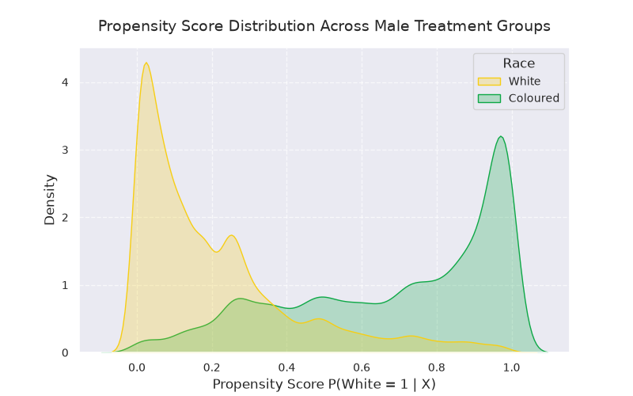
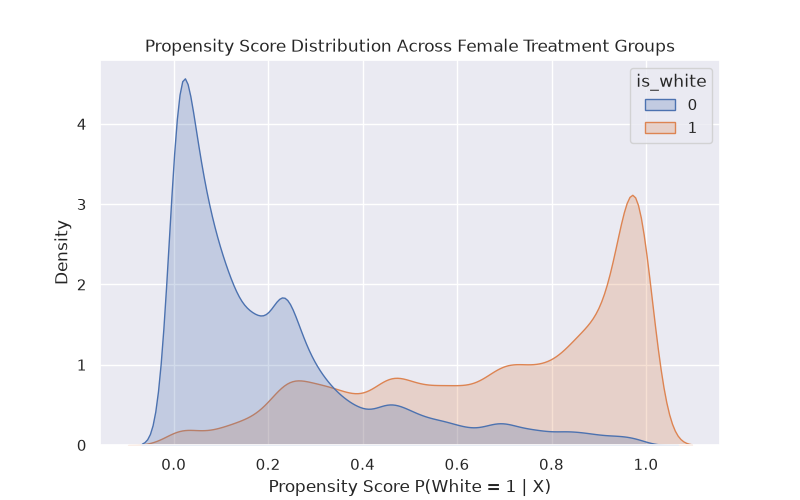

## Introduction

The history of South Africa stands as a fascinating case study for the field of `Causal Inference for Computational Social Science`. The Apartheid era was black-and-white legalized discrimination. The implementation of the National Party's ideological framework hinged on the Population Registration Act of 1950, which required every citizen to be classified and registered under racial categories. The government was then able to dictate an individual's rights from "cradle to grave" [@lawal_april_2024]. Legislation such as the Group Areas Act forced non-white populations into the country’s most economically unproductive areas, while "pass laws" criminalized the unregulated movement of Coloured citizens within urban spaces. Systemic oppression extended to all individual pursuits: schools were segregated and interpersonal relationships across racial lines were legally barred through measures like the Prohibition of Mixed Marriages Act. 

In their study examining the direct impacts of Apartheid-era racial classifications, [@pellicer_understanding_2023] utilized historical census microdata around the Registration Act of 1950 in a fuzzy Regression Discontinuity framework. Their findings demonstrate that receiving a White classification yielded a massive 4.5-fold increase in male income and an average of 5 additional years of formal education. This accounted for over 90% of the total observed mean income disparity between White and Coloured men.

Though Apartheid formally ended in 1994, whether market forces and post-Apartheid reforms have succeeded in closing historical gaps remains unknown. While all South Africans are now constitutionally recognized as equals, state policies such as employment equity targets [@sakeliga_quotas_2025] were explicitly designed to remediate historical disenfranchisement. These policies remain highly contentious; critics characterize them as unconstitutional forms of social engineering. The competing sociological and political realities underscore a fundamental economic inquiry: *in the wake of Apartheid, to what extent have labour market outcomes between racial categories actually changed?*

This study seeks to address this question by examining a decade of post-Apartheid labour dynamics using 10% microdata samples from the 2001 and 2011 South African Censuses. To address omitted variable bias and non-linearities, I employ various approaches to Ordinary Least Squares (OLS) regression including single cross-section, pooled cross-section, and propensity score matching. Ultimately, this paper evaluates whether the conditional racial wage gap between White and non-White individuals has narrowed, stagnated, or widened, providing new empirical evidence on post-Apartheid economic convergence.

## Data

This study uses data from the 2001 [@statssa_census_2001] and 2011 [@statssa_census_2011] South African Population Censuses^[Censuses are principal means of collecting basic population and housing statistics required for social and economic development, policy interventions, their implementation and evaluation; the Post-Apartheid South African government has conducted three Censuses, in 1996, 2001 and 2011] conducted by Statistics South Africa (Stats SA). Both the 2001 and 2011 datasets used in this analysis are 10% public-use samples of the full census population.

Observations with unspecified income or unknown employment status were excluded from the analysis. From 2011 alone, 339,531 observations (~7.8% of the sample) with unspecified income and 3,222 observations (~0.1% of the sample) with unknown employment status were removed prior to analysis.

The variables were selected to match those used in the original study, which analyzed differences using sex, race, years of education, employment status, and log income. For the 2011 Census, the following variables were extracted from the person-level dataset:

* **Sex** (`F03_SEX`), coded as 1 = Male and 2 = Female
* **Year of Birth** (`P01_YEAR`)
* **Population group** (`P05_POP_GROUP`), coded as Black African, Coloured, Indian/Asian, White, and Other
* **Income** (`P16_INCOME`), reported as categorical income brackets ranging from no income to R 2,457,601
* **Education** (`P20_EDULEVEL`), ranging from Grade 0 through higher degree, with additional categories for no schooling and other qualifications
* **Employment status** (`P23A_EMPLOYMENTSTATUS`), coded as employed, unemployed, or unknown
* **Province of birth** (`P07_PROV_POB`), indicating the respondent’s province of birth. Categories include the nine South African provinces, as well as outside South Africa, and do not know.
* **Usual residence province** (`P10A_USUALRESPROV`), capturing the respondent’s province of usual residence.
* **Geographic type** (`P_GEOTYPE`), identifying whether the respondent resides in an urban or rural area

For the 2001 Census, comparable variables were identified to maximize consistency across survey years. These included sex (`p03_sex`), race (`p06_race`), education (`p17_educ`), employment status (`der10_em`), and income (`p22_incm`). Additional demographic and geographic variables were retained, including year of birth (`p02_yr`), age (`p02_age`), province of birth (`p09a_prv`), usual residence (`p11c_pru`), and geographic classification (`EATYPE96`), which provides an urban/rural classification comparable to the 2011 geographic type variable.

The variable definitions were obtained from the official DataFirst data dictionary for the South African Census person dataset.

## Exploratory Analysis

Figure 1 presents descriptive statistics for the 2001 and 2011 Census samples by sex. Across both census years, men exhibited higher employment rates than women. In 2001, 39% of men were employed compared to 29% of women, while in 2011 employment increased slightly for both groups to 38% and 31%, respectively. Average log income also increased substantially between 2001 and 2011 for both sexes, with men consistently reporting higher average log incomes than women. Mean years of education increased considerably over the decade, rising from approximately 7.6 years in 2001 to 13.7 years in 2011 for both men and women. The proportion of White respondents remained relatively stable across years and sexes, accounting for roughly one-third of each analytic sample.

::: {#fig-summary layout-ncol=2}

{#fig-2001-table}

{#fig-2001-table}

2001 & 2011 Census Data Summary Tables
:::

The distribution of log income by race and sex is shown in Figure 2 for the 2001 and 2011 Census samples. Both years exhibit a pronounced spike at zero log income, reflecting individuals who reported no income. Among respondents with positive income, the distributions differ noticeably by race. White respondents display income distributions centered at higher log-income values than Coloured respondents for both men and women, with the White distributions shifted to the right and exhibiting a broader upper tail.

::: {#fig-income layout-ncol=2}

{#fig-2001-income}

{#fig-2011-income}

2001 & 2011 Income Density Plots
:::

Comparing the two census years, the overall shape of the income distributions remains similar, although the distributions for positive income shift toward higher log-income values in 2011. The separation between the White and Coloured income distributions is evident in both years for males and females, suggesting persistent differences in reported earnings across racial groups. Additionally, the income distributions for men are slightly shifted toward higher values than those for women within each racial group, consistent with the descriptive statistics reported in Figure 1.

## Models

The original study that this project builds on relied on fuzzy Regression Discontinuity^[According to FRDD, the outcome variable undergoes a sharp discontinuity at the threshold, but the assignment to a treatment or control group is not perfectly determined by this discontinuity; using a fuzzy score that reflects the degree of uncertainty associated with group assignment, it is possible to quantify the degree of noise in group assignment] designed to exploit localized exogenous^[An exogenous variable is an explanatory variable that is not correlated with the error term] variation. While fuzzy RD designs offer strong local internal validity, the primary drawback is in external validity: treatment effect estimates are localized strictly around the discontinuity threshold, limiting generalizability across broader populations. Additionally, standard Ordinary Least Squares (OLS) specifications capture strong predictive associations but fail to account for omitted variable bias^[For an omitted variable to bias the results, it must correlate with the dependent variable and at least one independent variable, making it a confounding variable]. 

To address these shortcomings, this analysis proceeds in stages. I first establish baseline cross-sectional OLS estimates stratified by gender using the 2011 sample. I then progress toward a more robust pooled cross-sectional design combining the 2001 and 2011 datasets. By pooling repeated cross-sections, I evaluate how racial wage premiums evolved over a decade of institutional change, while explicitly controlling for non-linear lifecycle cohort trajectories that typically confound single-year cross-sectional estimates. I conclude with Propensity Score Matching (PSM) to compare like-individuals. By matching White and Coloured individuals with similar education, ages, and locations, extreme outliers are discarded to provide a cleaner outlook on the current status of the racial wage gap. 

### Ordinary Least Squares on 2011 Alone

To establish a baseline relationship, I estimate an Ordinary Least Squares (OLS) regression separately for men and women using the 2011 sample. To account for non-linear lifecycle earnings dynamics while mitigating multicollinearity between age terms, year of birth is centered around the sample mean. The baseline specification is defined as:

$$
\text{Log Income}_i = \beta_0 + \beta_1 \text{White}_i + \beta_2 \text{EduYears}_i + \beta_3 \text{Age}_i + \beta_4 \text{Age}_i^2 + \beta_5 \text{Employed}_i + \varepsilon_i
$$

Because log income distributions frequently exhibit heteroskedastic error^[Heteroskedasticity occurs when the variance of the error terms is not constant across all levels of the independent variable(s)] structures across demographics, all specifications employ heteroskedasticity-consistent standard errors to ensure reliable hypothesis testing.

Figure 3 summarizes the 2011 OLS estimates stratified by gender. Across both specifications, all covariates are statistically significant at $p < 0.05$. The baseline controls account for $43.7\%$ of the variance in log income for women ($R^2 = 0.437, N = 110,480$) and $49.4\%$ of the variance for men ($R^2 = 0.494, N = 111,172$).

{#fig-2011-OLS}

The estimated returns to education are higher for men ($14.9\%$ log income gain per additional year of schooling) than for women ($13.3\%$). Similarly, the white wage premium is noticeably larger for men ($\hat{\beta}_1 = 0.774$) than for women ($\hat{\beta}_1 = 0.582$).

The income advantage associated with active employment is almost identical across genders, approximately a $76\%$ log-income gain relative to non-employed individuals ($\hat{\beta}_2 = 0.762$).

The negative linear coefficient on centered YOB alongside the negative quadratic term reflects the concave lifecycle earnings profile, capturing declining earnings for younger cohorts relative to middle-aged workers in the 2011 cross-section.

### OLS on Pooled Data

To address potential identification threats inherent in a single cross-section, the OLS model was expanded by pooling data from the 2001 and 2011 census. An a priori threat to causal inference in single-year cross-sectional models is that individual income exhibits a pronounced non-linear lifecycle trajectory. In a single cross-section, year of birth ($\text{YOB}$) and current age are perfectly collinear, making it difficult to disentangle true shifts from standard career trajectory.

By introducing a second observation point a decade prior, individuals of similar ages at different points in time are observed and specific birth cohorts across different career stages are tracked. This temporal variance better identifies and controls for non-linear lifecycle patterns while evaluating structural shifts in the racial wage gap over time. The specification is defined as:

$$
\text{Log Income}_{it} = \beta_0 + \beta_1 \text{White}_{it} + \beta_2 \text{IsYear2011}_t + \beta_3 (\text{White}_{it} \times \text{IsYear2011}_t) + {\gamma} \mathbf{X}_{it} + \varepsilon_{it}
$$

To ensure comparability across survey years, income measures were *wrangled* prior to logarithmic transformation. The 2001 Census captured monthly income ranges, whereas the 2011 Census captured annual income ranges. Monthly 2001 values were converted to annual terms and adjusted for aggregate inflation using CPI metrics to reflect real constant 2011 values.

Figure 4 presents the pooled regression results for men ($N = 235,944$) and women ($N = 227,942$). The pooled specifications explain the variance with an $R^2 = 0.558$ for men and $R^2 = 0.495$ for women.

{#fig-pooled-OLS}

In the pooled model, the quadratic cohort term (${YOB}^2$) is negative and highly significant ($\hat{\beta} = -0.000, p < 0.01$), confirming an inverted-U lifecycle earnings profile across birth cohorts.

Active employment yields substantial log-income gains across both specifications ($\hat{\beta} = 0.763$ for men; $\hat{\beta} = 0.705$ for women, representing a $100\%–115\%$ wage premium over non-working or zero-income baselines). Furthermore, returns to formal education in the pooled model are consistently high across both genders, yielding an estimated $13\%$ increase in log earnings per year of schooling for men ($\hat{\beta} = 0.129$) and $12\%$ for women ($\hat{\beta} = 0.116$).

### Propensity Score Matching

Estimating the causal impact of demographic attributes on economic outcomes presents a fundamental problem of causal inference: counterfactual outcomes for a given individual are unobservable. To approximate experimental conditions in observational microdata, this study employs Propensity Score Matching (PSM) [@rosenbaum1983central].The propensity score, $e(X_i)$, is defined as the conditional probability of receiving treatment $D_i$ given a vector of observed pre-treatment covariates $X_i$:

$$
e(X_i) = P(D_i = 1 \mid X_i)
$$

In this context, the treatment variable $D_i$ indicates racial classification, where $D_i = 1$ denotes White individuals and $D_i = 0$ denotes Coloured. The vector $X_i$ contains year of birth, education, province of birth, urban residence, and employment status, variables that dictate selection into treatment status.

Matching constructs a counterfactual control group by pairing each treated observation with control observations exhibiting similar predicted propensity scores. Under the assumption of conditional independence, this procedure eliminates selection bias on observable characteristics.

The propensity scores are estimated separately by gender using logistic regression:

$$
\text{logit}(P(D_i = 1 \mid X_i)) = \beta_0 + \beta_1 \text{YOB}_i + \beta_2 \text{YOB}_i^2 + \beta_3 \text{Edu}_i + \beta_4 \text{Employed}_i + \beta_5 \text{Urban}_i + \gamma \text{Province}_i + \delta \text{IsYear2011}_i
$$

To satisfy the common support assumption that there is an overlap in the propensity score distributions between treatment and control groups, sample bounds are enforced using min-max trimming on the logit scale:

$$
\text{Supp}(P(X \mid D=1)) \cap \text{Supp}(P(X \mid D=0)) \neq \emptyset
$$

Observations falling outside the mutual logit-score boundaries are discarded to eliminate boundary extrapolation. As illustrated by figure 5, substantial common support exists across both sub-samples. 

::: {#fig-common-support layout-ncol=2}

{#fig-male}

{#fig-female}

Propensity Score Common Support Visualizations by Gender
:::

The OLS model is specified as:

$$
\log(\text{Real Income}_i) = \alpha + \beta_1 \text{White}_i + \beta_2 \text{IsYear2011}_i + \beta_3 (\text{White}_i \times \text{IsYear2011}_i) + \boldsymbol{\mathbf{X}_i\Gamma} + \mathbf{\delta_p} + \varepsilon_i
$$

where $\boldsymbol{\mathbf{X}_i}$ includes employment status, years of education, centered year of birth, quadratic age controls, and residence type, while $\mathbf{\delta_p}$ represents province-of-birth fixed effects. Heteroskedasticity-robust standard errors are reported across all models.

{#fig-propensity-OLS}

Holding education, age, geography, and employment status constant on matched support, White men earned a baseline premium of $0.628$ log points ($e^{0.638} = 87\%$) over Coloured men in 2001. White women earned a smaller baseline premium of $0.399$ log points ($e^{0.399} = 49\%$). For men, the interaction term is negative and statistically significant ($\beta_3 = -0.110, p < 0.01$). This indicates that the racial wage gap among demographically matched male peers narrowed by $10.4\%$ over the decade. For women, the interaction coefficient is statistically indistinguishable from zero ($\beta_3 = -0.003, p = 0.882$). The conditional racial wage gap among comparable women remained stagnant over the period. Years of education yield strong positive returns across both groups, with men experiencing slightly higher wage returns per year of education ($16.3\%$) relative to women ($13.4\%$).

## Evaluation

In the final matched OLS model, each additional year of education carries a consistent, high return, boosting real log income by $16.3\%$ for men and $13.4\%$ for women. Similarly, employment status represents the single largest earnings jump in the model (increasing log income by $0.87$–$0.93$).

Pooling the 2001 and 2011 waves reveals a clear split in how the racial wage gap changed over time once demographically matched peers are compared:

- Men: The coefficient on White × Year 2011 is $-0.110$ ($p < 0.01$). This indicates that among demographically comparable men, the conditional racial wage gap narrowed by $10.4\%$ over the decade.

- Women: The interaction coefficient is $-0.003$ ($p = 0.882$), which is statistically indistinguishable from zero. Even after matching on education and location, the female racial wage gap remained stagnant between 2001 and 2011.

Complementing these regression coefficients, the Empirical Cumulative Distribution Function (ECDF) plot below confirms first-order stochastic dominance^[Random variable A has first-order stochastic dominance over random variable B if for any outcome x, A gives at least as high a probability of receiving at least x as does B, and for some x, A gives a higher probability of receiving at least x]. Across both 2001 and 2011, the real income distribution for White workers sits strictly to the right of non-White workers across virtually every quantile. This proves that the racial premium estimated in our OLS regressions is driven by broad, systemic income differences across the whole economy, rather than being skewed by a few ultra-high earners at the top.

## Conclusion

This paper evaluated post-Apartheid racial income disparities in South Africa by tracking a cohort of workers across the 2001 and 2011 Census waves. By combining repeated cross-sections with a doubly robust Propensity Score Matching (PSM) and fixed-effects OLS regression design, the analysis isolates earnings differences among demographically comparable peers on common support. 

Ultimately, the results demonstrate that while expanding access to education and employment is vital, human capital accumulation alone has not been enough to achieve equal earnings outcomes. 

## Acknowledgments {.unnumbered}

Thanks to Professor Jeff Power Jacobs

## References {.unnumbered}

::: {#refs}
:::
